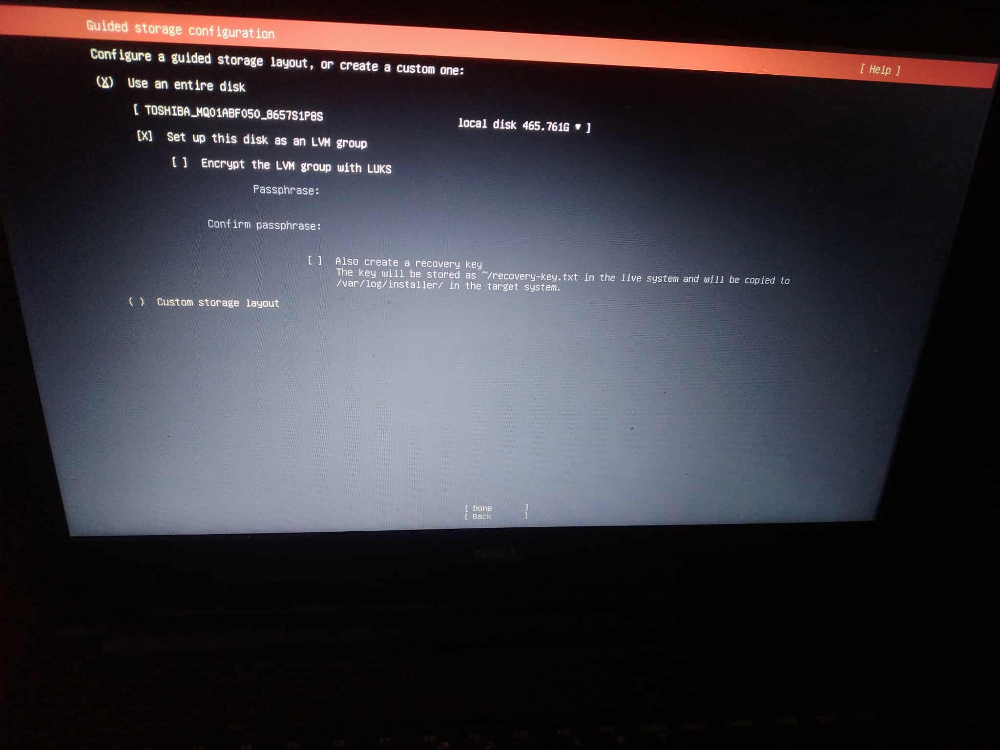
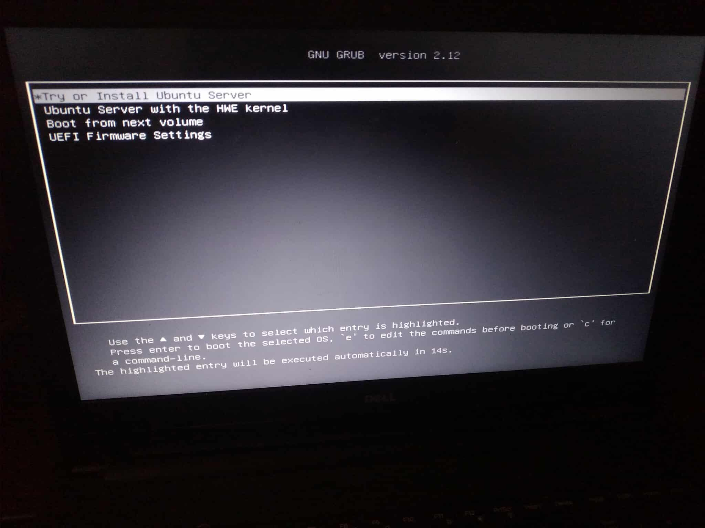
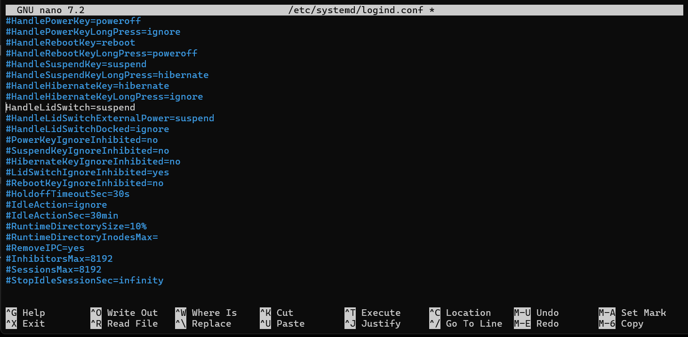
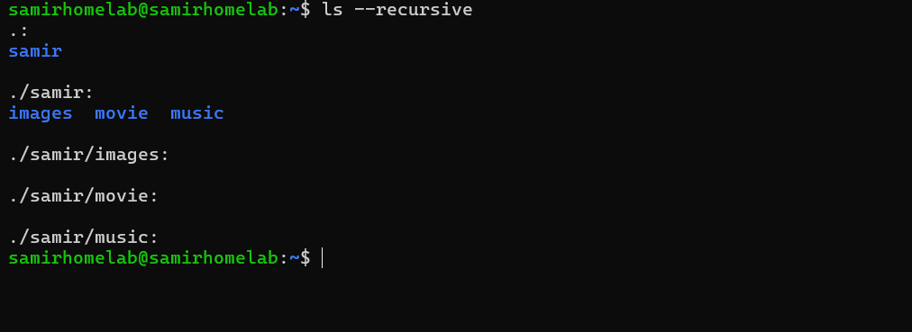
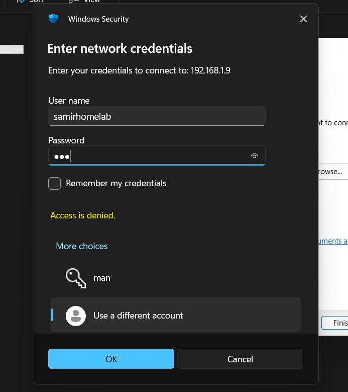
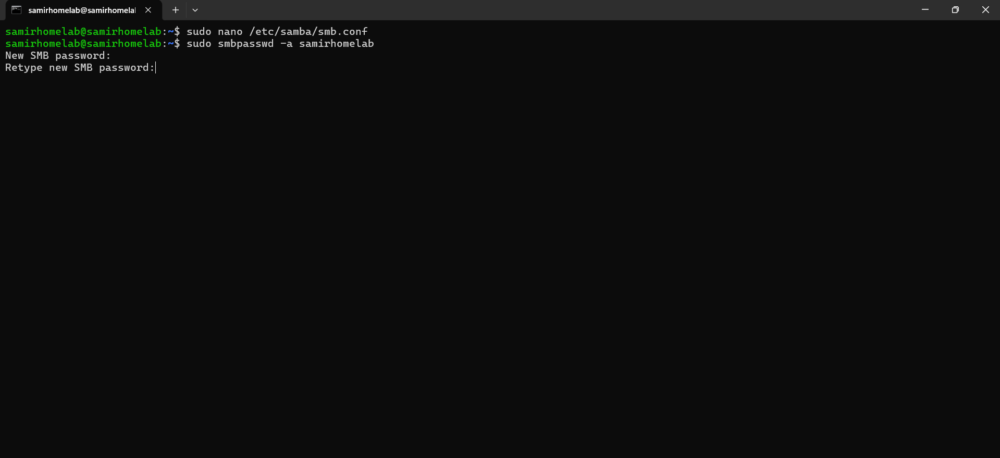
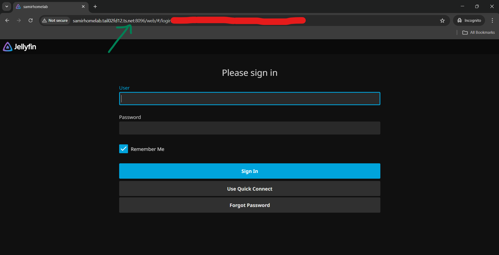
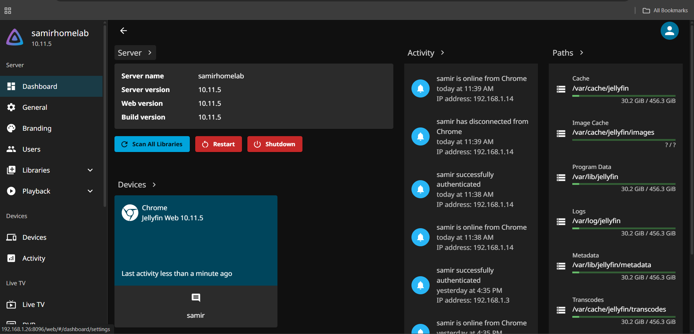
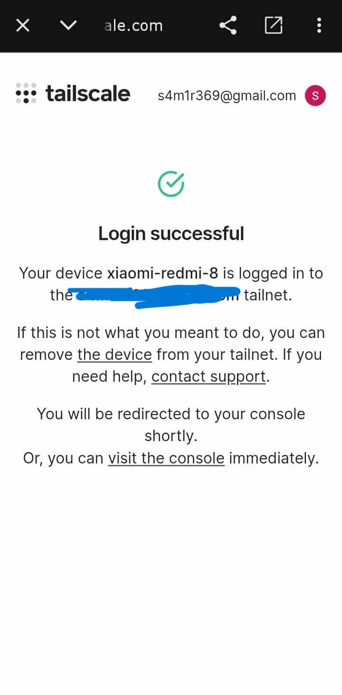
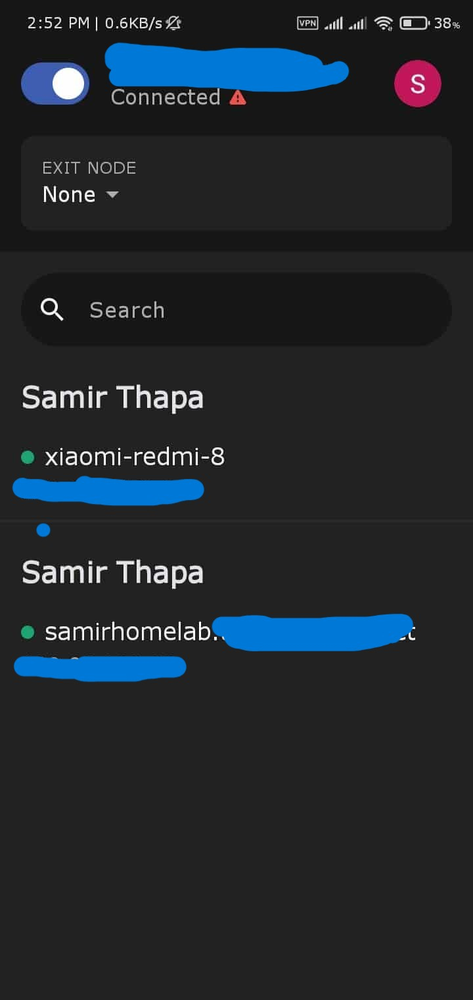

# Media Server

A simple home media server built from an old laptop.

---

## Setup Overview

| Role               | Device            | Specs                       |
| ------------------ | ----------------- | --------------------------- |
| **Server**         | Dell Vostro (Old) | Intel Celeron 4020, 4GB RAM |
| **Primary Laptop** | HP Victus (main)  | Intel i5 12th Gen, 16GB RAM |

The old Dell Vostro now runs Ubuntu Server, hosting Jellyfin for media streaming. The primary laptop handles all administration and file transfers via Samba. Mobile access is enabled through Tailscale with restricted port access.

---

## Table of Contents

- [Hardware](#hardware)
- [Network Topology](#network-topology)
- [Installation](#installation)
- [Initial System Checks](#initial-system-checks)
- [Firewall and Network Validation](#firewall-and-network-validation)
- [Network Setup](#network-setup)
- [Server Configuration (Lid Behavior)](#server-configuration-lid-behavior)
- [Storage Layout](#storage-layout)
- [Samba Setup (File Sharing)](#samba-setup-file-sharing)
- [SMB Troubleshooting](#smb-troubleshooting-what-actually-fixed-it)
- [Jellyfin Streaming](#jellyfin-streaming)
- [Remote Access with Tailscale](#remote-access-with-tailscale)
- [Mobile Access](#mobile-access)
- [Takeaways](#takeaways)
- [Future Plans](#future-plans)

---

## Hardware

The server runs on an old Dell Vostro laptop with Intel Celeron 4020 and 4GB RAM. Nothing fancy, just repurposed hardware that would otherwise collect dust.

---

## Network Topology

Here's the overall network architecture showing how the media server fits into the home network.

---

## Installation

Before installation, I entered the BIOS, verified the boot mode, and booted from a USB installer.

During installation:

- The entire disk was wiped and reused for Ubuntu Server

- Wi-Fi was configured (Ethernet wasn't practical in my room)

- A minimal installation was selected
- Username and password were created

- The installation proceeded after completing all configuration steps

After installation completed, the system rebooted into Ubuntu Server.

At this point, I unplugged the keyboard and display. From here on, the laptop was managed entirely over the network. This was the moment the laptop stopped behaving like a personal computer and started behaving like a server.

---

## Initial System Checks

Once connected to the server, the first thing I did was check for updates and bring the system fully up to date.

I also checked the IP address assigned to the server so I could confirm network connectivity from my main laptop.

---

## Firewall and Network Validation

Before exposing any services, I verified the basics:

- Firewall (UFW) status
- Listening ports
- Network connectivity

UFW was checked to confirm the firewall state with appropriate rules in place.

---

## Network Setup

The server connects wirelessly through a secondary router.

**Why Wi-Fi?** The primary router sits in an awkward spot, and running Ethernet across the room wasn't practical. Wi-Fi was good enough to get started.

**Why a dynamic IP instead of static?** I don't have access to the primary router to configure static leases. Tailscale makes this irrelevant by assigning consistent internal addresses through its mesh network.

The secondary router keeps server traffic isolated and reduces the risk of disrupting the main network.

---

## Server Configuration (Lid Behavior)

Because this is still laptop hardware, power behavior needed adjustment. Closing the lid should not suspend the system.

The configuration was changed so the screen blanks while the server continues running normally.

This single change made the setup feel intentional rather than temporary.

With the lid closed, the server continues running quietly in the background, fully accessible over the network.

---

## Storage Layout

Before deploying any services, storage was organized into a simple structure:

- One location for general files and backups
- One location dedicated to media content

Separating these early avoided permission issues later when services needed access to specific directories.

---

## Samba Setup (File Sharing)

To enable file access from my main laptop, Samba was installed and configured.

After configuration, the server appeared like a normal shared drive on the network.

The Samba configuration was set to restrict access to only one specific user for security.

After editing configuration files, the Samba service was restarted and its status verified.

From Windows File Explorer on the main laptop, I connected using the server's local IP and share name.

Only the main laptop was allowed access, keeping the share restricted.

---

## SMB Troubleshooting (What Actually Fixed It)

Samba was the most time-consuming part of the setup. Multiple "Access Denied" errors occurred before everything finally worked.

**What fixed it:**

- Explicitly adding a Samba password for the Linux user
- Clearing cached Windows credentials
- Fixing directory ownership
- Using the correct username format when logging in

Each issue on its own was small, but together they made Samba feel deceptively difficult.

---

## Jellyfin Streaming

With file sharing working, Jellyfin was installed.

The service was enabled, status verified, and accessed from the main laptop through a browser.

After pointing Jellyfin to the media directory and allowing it to scan, media became available almost immediately.

Even over Wi-Fi, playback was smooth on both laptop and phone. The Celeron handled the workload better than expected.

---

## Remote Access with Tailscale

Everything worked locally but remote access was the next challenge.

Instead of port forwarding or dynamic DNS, I chose Tailscale.

Tailscale was installed, enabled, and authenticated. Once connected, the server appeared as part of a private mesh network.

Using Tailscale's MagicDNS, I could access Jellyfin from other devices on the internet as if I were at home.

No open ports. No firewall gymnastics. No exposed services.

---

## Mobile Access

To allow mobile access to Jellyfin, I used Tailscale's sharing feature with a shared account. This provides secure remote access while limiting functionality.

### Shared Account Setup

The mobile device is connected through a **shared Tailscale account** that has access restricted to only port **8096** (Jellyfin's default port).

### Access Control Lists (ACLs)

ACLs were configured to ensure the shared user can only access the Jellyfin streaming port, nothing else on the server.

**Understanding src and dst in ACL rules:**

When giving access to only port 8096 to shared users, you need to understand how firewall rules work:

- **src (Source)** is who is starting the connection (the user/mobile device)
- **dst (Destination)** is the device receiving the connection (the Home Server)

So when configuring ACLs, the Home Server is the `dst` (destination), not the `src`.

### Mobile Setup

Tailscale was downloaded and set up on the mobile device.

Once connected, the Jellyfin dashboard became accessible from the phone.

This setup allows streaming from anywhere while keeping the server secure. The shared account can only see port 8096, no file shares, nothing else.

---

## Takeaways

This project was never about building something impressive. It was about understanding:

- How systems behave when they run continuously
- How small configuration mistakes break stable services
- How much value can be extracted from old hardware

The Dell Vostro now runs quietly in the background with the lid closed and the screen off. Samba handles file sharing. Jellyfin handles media streaming. Tailscale handles secure remote access.

What started as curiosity turned into a home server that actually gets used daily.

---

## Future Plans

- Add stricter firewall rules with UFW
- Flash OpenWRT on the router
- Upgrade hardware and migrate to Proxmox
- Move to Cloudflare Tunnels with a custom domain
- Add monitoring and automated backups

The setup will continue to evolve but for now, it does exactly what it was built to do.
