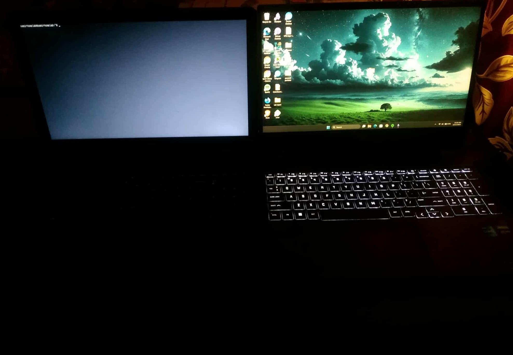
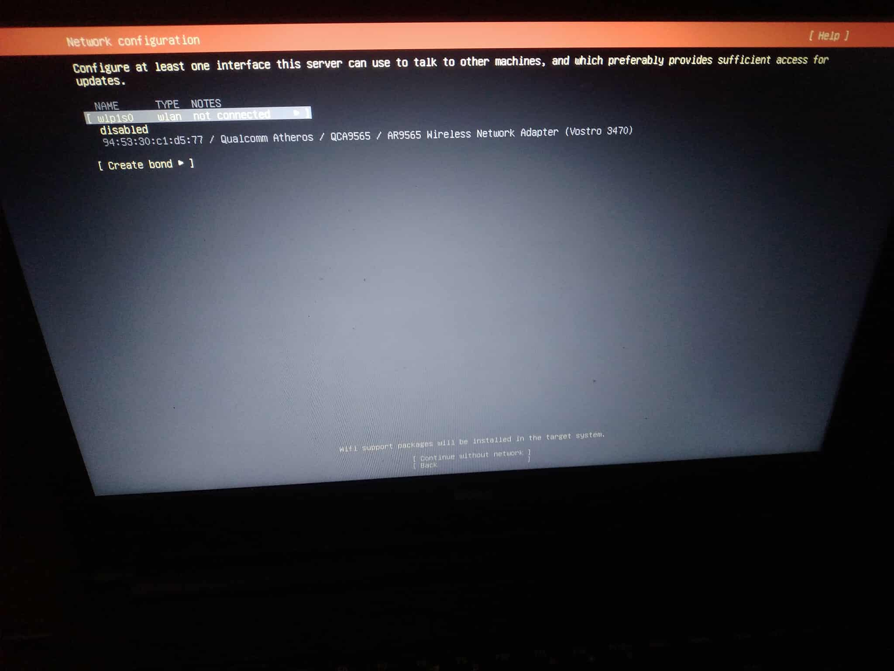
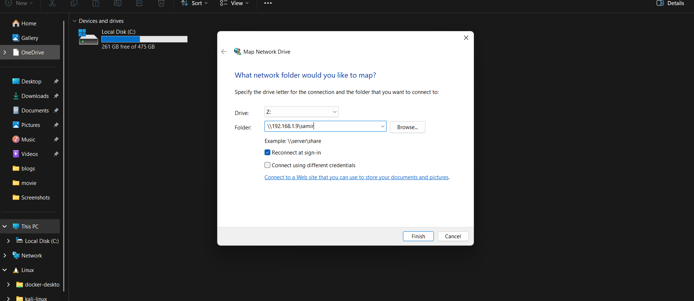
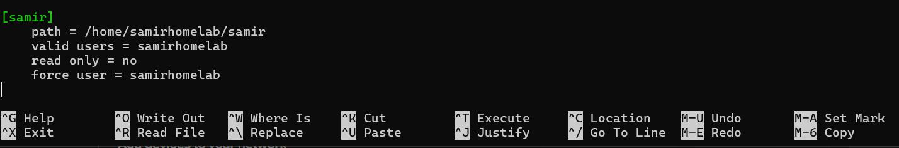
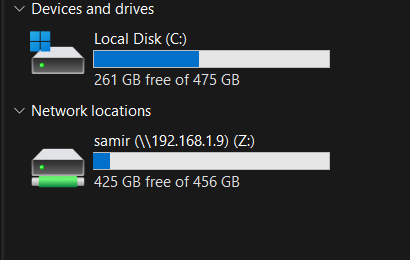
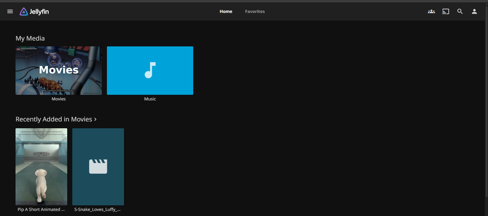
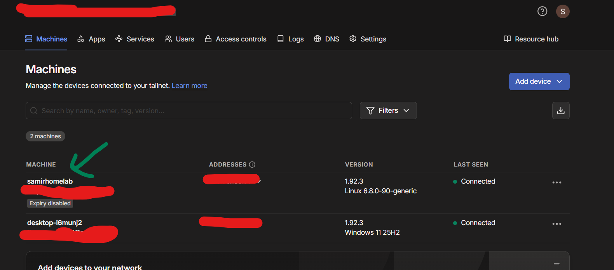
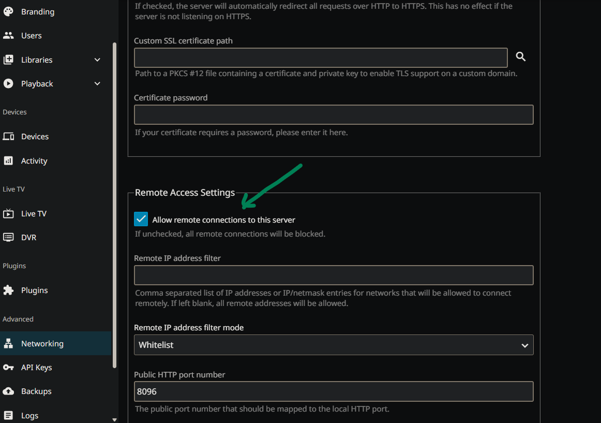

# Media Server

Simple Media Server from an Old Laptop.

---

## Table of Contents

- [Hardware](#hardware)
- [Network Topology](#network-topology)
- [Installation](#installation)
- [Initial System Checks](#initial-system-checks)
- [Firewall, SSH, and Network Validation](#firewall-ssh-and-network-validation)
- [Network Setup](#network-setup)
- [Server Configuration (Lid Behavior)](#server-configuration-lid-behavior)
- [Storage Layout](#storage-layout)
- [Samba Setup (File Sharing)](#samba-setup-file-sharing)
- [SMB Troubleshooting](#smb-troubleshooting-what-actually-fixed-it)
- [Jellyfin Streaming](#jellyfin-streaming)
- [Remote Access with Tailscale](#remote-access-with-tailscale)
- [Takeaways](#takeaways)
- [Future Plans](#future-plans)
- [Images to Add](#images-to-add)

---

## Hardware

The server runs on an old Dell Vostro laptop. It's nothing fancy—just repurposed hardware that would otherwise collect dust.

---

## Network Topology

Before diving into the setup, here's the overall network architecture showing how the media server fits into the home network.

---

## Installation

Before installation, I entered the BIOS, verified the boot mode, and booted from a USB installer.

During installation:

- The entire disk was wiped and reused for Ubuntu Server

- Wi-Fi was configured (Ethernet wasn't practical in my room)

- A minimal installation was selected
- Username and password were created

- SSH was enabled directly from the installer

After installation completed, the system rebooted into Ubuntu Server.

At this point, I unplugged the keyboard and display. From here on, the laptop was managed entirely over the network.

This was the moment the laptop stopped behaving like a personal computer and started behaving like a server.

---

## Initial System Checks

Once connected over SSH, the first thing I did was check for updates and bring the system fully up to date.

> **[Add image here: package update output]**
>
> Capture showing `sudo apt update && sudo apt upgrade` output.

I also checked the IP address assigned to the server so I could confirm network connectivity from my main laptop.

---

## Firewall, SSH, and Network Validation

Before exposing any services, I verified the basics:

- SSH service status
- Firewall (UFW) status
- Listening ports

SSH was confirmed running, and I could successfully connect from my main laptop using the local IP.

UFW was checked to confirm the firewall state. SSH access was allowed so I wouldn't lock myself out.

> **[Add image here: UFW status output]**
>
> Capture showing `sudo ufw status` output with SSH allowed.

---

## Network Setup

The server connects wirelessly through a secondary router.

**Why Wi-Fi?** The primary router sits in an awkward spot, and running Ethernet across the room wasn't practical. Wi-Fi was good enough to get started.

**Why a dynamic IP instead of static?** I don't have access to the primary router to configure static leases. Tailscale makes this irrelevant by assigning consistent internal addresses through its mesh network.

The secondary router keeps server traffic isolated and reduces the risk of disrupting the main network.

> **[Add image here: Wi-Fi adapter / router setup]**
>
> Photo of the router or network adapter configuration.

---

## Server Configuration (Lid Behavior)

Because this is still laptop hardware, power behavior needed adjustment. Closing the lid should not suspend the system.

The configuration was changed so the screen blanks while the server continues running normally.

This single change made the setup feel intentional rather than temporary.

> **[Add image here: lid closed with server running]**
>
> Photo of the laptop with lid closed but server still accessible via SSH.

---

## Storage Layout

Before deploying any services, storage was organized into a simple structure:

- One location for general files and backups
- One location dedicated to media content

Separating these early avoided permission issues later when services needed access to specific directories.

---

## Samba Setup (File Sharing)

To enable file access from my main laptop, Samba was installed and configured.

After configuration, the server appeared like a normal shared drive on the network.

After editing configuration files, the Samba service was restarted and its status verified.

From Windows File Explorer on the main laptop, I connected using the server's local IP and share name.

Only the main laptop was allowed access, keeping the share restricted.

---

## SMB Troubleshooting (What Actually Fixed It)

Samba was the most time-consuming part of the setup. Multiple "Access Denied" errors occurred before everything finally worked.

**What fixed it:**

- Explicitly adding a Samba password for the Linux user
- Clearing cached Windows credentials
- Fixing directory ownership
- Using the correct username format when logging in

Each issue on its own was small, but together they made Samba feel deceptively difficult.

> **[Add image here: Samba password setup or troubleshooting terminal]**
>
> Capture showing `sudo smbpasswd -a username` command.

---

## Jellyfin Streaming

With file sharing working, Jellyfin was installed.

The service was enabled, status verified, and accessed from the main laptop through a browser.

After pointing Jellyfin to the media directory and allowing it to scan, media became available almost immediately.

Even over Wi-Fi, playback was smooth on both laptop and phone. The Celeron handled the workload better than expected.

> **[Add image here: Jellyfin playback screen]**
>
> Capture showing video playback in Jellyfin.

---

## Remote Access with Tailscale

Everything worked locally—but remote access was the next challenge.

Instead of port forwarding or dynamic DNS, I chose Tailscale.

Tailscale was installed, enabled, and authenticated. Once connected, the server appeared as part of a private mesh network.

> **[Add image here: Tailscale status / device list]**
>
> Capture showing `tailscale status` output or Tailscale admin console.

Using Tailscale's MagicDNS, I could access Jellyfin from other devices on the internet as if I were at home.

No open ports. No firewall gymnastics. No exposed services.

---

## Takeaways

This project was never about building something impressive. It was about understanding:

- How systems behave when they run continuously
- How small configuration mistakes break stable services
- How much value can be extracted from old hardware

The Dell Vostro now runs quietly in the background with the lid closed and the screen off. Samba handles file sharing. Jellyfin handles media streaming. Tailscale handles secure remote access.

What started as curiosity turned into a home server that actually gets used daily.

---

## Future Plans

- Add stricter firewall rules with UFW
- Flash OpenWRT on the router
- Upgrade hardware and migrate to Proxmox
- Move to Cloudflare Tunnels with a custom domain
- Add monitoring and automated backups

The setup will continue to evolve—but for now, it does exactly what it was built to do.

---

## Images to Add

The following images are **suggested additions** to complete the documentation:

| Section               | Image Description                                             | Suggested Filename       |
| --------------------- | ------------------------------------------------------------- | ------------------------ |
| Initial System Checks | Package update output (`sudo apt update && sudo apt upgrade`) | `package_update.png`     |
| Firewall Validation   | UFW status output (`sudo ufw status`)                         | `ufw_status.png`         |
| Network Setup         | Photo of Wi-Fi adapter or secondary router                    | `router_setup.jpg`       |
| Lid Behavior          | Photo of laptop with lid closed while server is running       | `lid_closed_running.jpg` |
| SMB Troubleshooting   | Terminal showing `smbpasswd` command                          | `samba_password.png`     |
| Jellyfin Streaming    | Video playback screen in Jellyfin                             | `jellyfin_playback.png`  |
| Tailscale             | Tailscale status command output or admin console              | `tailscale_status.png`   |

---

## Currently Included Images (19 total)

| Image File                          | Description                          | Section Used                           |
| ----------------------------------- | ------------------------------------ | -------------------------------------- |
| `laptops.jpg`                       | Hardware - Dell Vostro laptop        | Hardware                               |
| `homelabdiagram.png`                | Network topology diagram             | Network Topology                       |
| `choosing ubunutu boot .jpg`        | BIOS/boot menu with Ubuntu selected  | Installation                           |
| `ubuntu_entire-disk.jpg`            | Disk partitioning during install     | Installation                           |
| `wifi.jpg`                          | Wi-Fi configuration screen           | Installation                           |
| `setting username and password.jpg` | User creation during install         | Installation                           |
| `installing ubuntu.jpg`             | Ubuntu installation progress         | Installation                           |
| `sshtoserver.png`                   | SSH session from main laptop         | Initial System Checks / SSH Validation |
| `sambaipaddress.png`                | IP address output                    | Initial System Checks                  |
| `lidconfig.png`                     | logind.conf lid behavior config      | Server Configuration                   |
| `folderstructure.png`               | Directory structure output           | Storage Layout                         |
| `smbconf.png`                       | Samba smb.conf configuration         | Samba Setup                            |
| `sambaserver.png`                   | Samba service status                 | Samba Setup                            |
| `smbdconnect.png`                   | Windows File Explorer SMB connection | Samba Setup                            |
| `authencationpage.png`              | Jellyfin login/auth page             | Jellyfin Streaming                     |
| `dashboardjelly.png`                | Jellyfin dashboard view              | Jellyfin Streaming                     |
| `homejelly.png`                     | Jellyfin home page                   | Jellyfin Streaming                     |
| `homepane.png`                      | Jellyfin home pane view              | Jellyfin Streaming                     |
| `remoteaccess.png`                  | Jellyfin accessed via Tailscale      | Remote Access                          |
